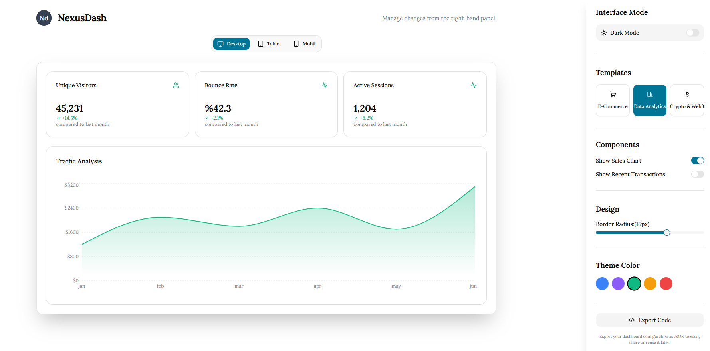
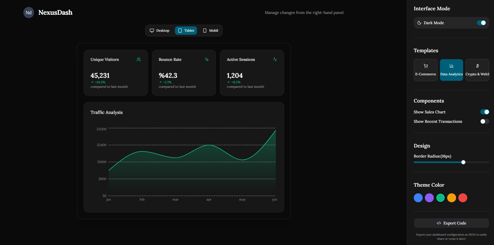
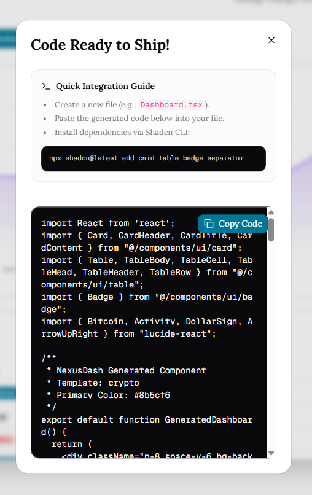
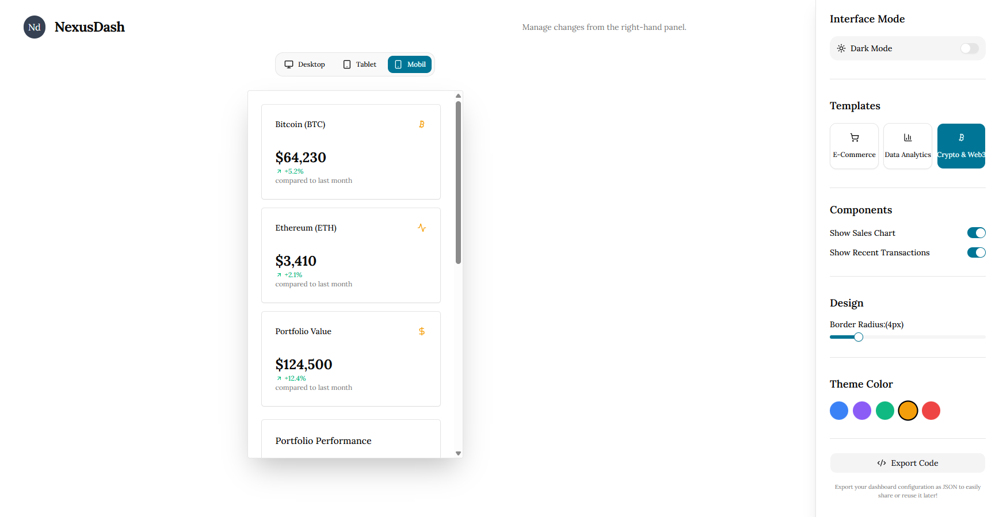

# ⚡ NexusDash - The Ultimate SaaS Prototyping Engine


**NexusDash** is a high-performance **Next.js 16** application designed for developers and SaaS founders to prototype enterprise-grade dashboard interfaces in seconds. Beyond being a visual editor, it is a full-scale engineering tool featuring a **Zustand-powered** state engine, sector-specific template presets, and a dynamic code generator.

[Live Demo](https://dashboard-generator-peach.vercel.app/) | [Report Bug](https://github.com/kasimugur/dashboard-generator/issues) | [Star the Repo ⭐](https://github.com/kasimugur/dashboard-generator)

-----

## 📍 Table of Contents
- [🚀 Features](#-features)
- [🛠️ Tech Stack](#️-tech-stack)
- [🎥 Demo & Screenshots](#-demo--screenshots)
- [🏗️ Architecture & Performance](#️-architecture--performance)
- [📦 Installation & Setup](#-installation--setup)
- [🗺️ Roadmap](#️-roadmap)
- [🔗 Contact](#-contact)

-----

## 🚀 Features

- **Dynamic Template Engine:** One-click presets for E-Commerce, Crypto, and Analytics sectors with tailored data sets and UI components.
- **Live Code Generator:** Instantly transform your custom design into clean, production-ready Next.js + Tailwind CSS code.
- **Responsive Device Simulator:** Test your dashboard across Mobile, Tablet, and Desktop viewports with smooth transitions.
- **Global State Management:** Real-time reactivity for theme colors and layout configurations powered by a high-performance Zustand store.
- **Dark Mode Excellence:** Full support for dark/light themes via `next-themes` and Shadcn/UI integration.

### ⏱️ The NexusDash Advantage
| Feature    | ❌ Traditional Way           | ⚡ With NexusDash         |
| :--------- | :-------------------------- | :----------------------- |
| Setup      | Install libraries & configs | Ready to go              |
| Layout     | Manual CSS & grid work      | Pick and toggle          |
| Components | Build from scratch          | Instantly generated      |
| Total Time | **2–6 Hours** | **< 60 Seconds** |

---

## 🛠️ Tech Stack
- **Framework:** Next.js 16 (App Router)
- **Language:** TypeScript
- **State Management:** Zustand (Zero-boilerplate centralized state)
- **Styling:** Tailwind CSS & Shadcn/UI
- **Data Visualization:** Recharts (Dynamic SVG-based charting)
- **Icons:** Lucide React

---

## 🏗️ Architecture & Performance

The application is engineered for scalability and developer efficiency:

- **Atomic Component Structure:** Separated `editor`, `preview`, and `ui` layers for high modularity and ease of maintenance.
- **State Optimization (Zustand):** Avoided React Context API for frequent UI updates to ensure 60fps responsiveness and prevent unnecessary re-renders during customization.
- **String Manipulation Engine:** A custom compiler layer (`lib/generateCode.ts`) that maps the current JSON configuration into a clean JSX template literal for instant export.
- **Viewport Transformation:** Uses CSS transitions combined with dynamic Tailwind `max-w` constraints to simulate device viewports accurately without heavy iframes.

---

## 📦 Installation & Setup

Follow these steps to run the project locally:

```bash
# Clone the repository
git clone [https://github.com/kasimugur/dashboard-generator](https://github.com/kasimugur/dashboard-generator)

# Enter the directory
cd dashboard-generator

# Install dependencies
npm install

# Run the development server
npm run dev
````

Open `http://localhost:3000` in your browser to start building.

-----

## 🗺️ Roadmap

  - [ ] Add more chart types (Pie, Area, Radar)
  - [ ] Drag-and-drop widget reordering
  - [ ] Multi-page dashboard support
  - [ ] Export to Vue/Svelte versions

-----

## 🎥 Screenshots

| 🌑 Dark Mode |  💻 Code Export Modal |📱 Mobile Simulation |
|---|---|---|
| |  |  |

-----

# 🔗 Contact

**Developer:** Kasım Uğur  
**GitHub:** [kasimugur](https://github.com/kasimugur/)  
**LinkedIn:** [kasimugur](https://www.linkedin.com/in/kasimugur/)
